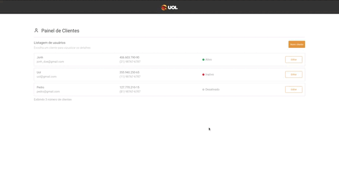

# Aplicativo de Gerenciamento de Clientes

[Link para o site](https://client-management-front.onrender.com)



## Tecnologias Usadas

Testes:
> Jest

DevOps:
> Docker, GitHub Actions

DataBase:
> SqLite

### Back-End:

> NodeJS, Nest.Js, Prisma ORM, Typescript

### Front-End:

> React, Typescript, Context

## Executando a Aplicação

<details>
  <summary><b>Iniciando o projeto com docker-compose 🐳</b></summary>

  ***⚠️ Para garantir um bom funcionamento é necessário que tenha instalado o docker e o docker-compose nas versões 24.0.5 e 1.29 ou superior respectivamente⚠️***

  1. Clone o projeto

  2. Entre no diretório do projeto

  3. No diretório principal suba os containers

  ```bash
$ docker-compose -f docker-compose.dev.yml up --build -d
  ```

  5. Quando o processo dos containers estiver acabado acesse a aplicação usando o seguinte endereço

  ```bash
http://localhost:3000
  ```

  6. Para derrubar os containers

  ```bash
$ docker-compose -f docker-compose.dev.yml down --rmi all --volumes --remove-orphans
  ```

</details>

<br />

Para executar as aplicações com node entre nas pasta do projeto (backend e frontend) para mais informações

## Rodando os testes E2E

  1. Garanta que já tenha iniciado e configurado o projeto

  2. A url do frontend por padrão é http://localhost:3000 para altera-lá basta adicionar um aquivo .env dentro do diretorio `__tests__`

  ```bash
$ echo "BASE_URL_CYPRESS=<SUA_URL>" > .env
  ```

 5. Inicie o frontend

  ```bash
$ npm start
  ```

  3. Para um bom funcinamento dos testes para inciar rode o seguinte comando no backend

  ```bash
$ npm run start:test
  ```

  6. Dentro do diretorio `__tests__` basta rodar o seguinte comando para iniciar os testes

  ```bash
$ npx cypress run # Para rodar no terminal
  # Ou
  npx cypress open # Para ver de forma visual os testes rodando
  ```

  Obs: Os testes e2e só funcionam com a aplicação rodando fora do docker
