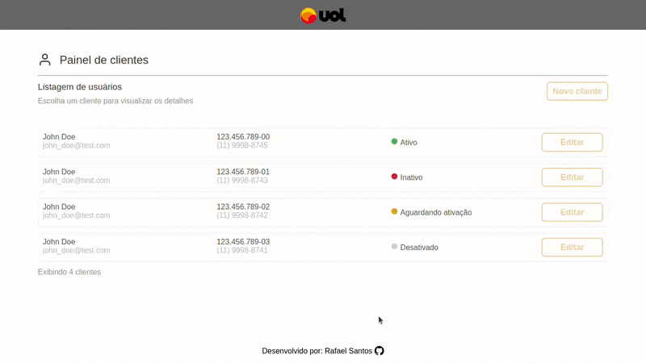

# Teste Fullstack: Aplicativo de Gerenciamento de Clientes

### Ferramentas Frontend:

- [Vite](https://vitejs.dev/)
- [React](https://pt-br.reactjs.org/)
- [TypeScript](https://www.typescriptlang.org/)
- [Yup](https://github.com/jquense/yup)
- [React-Toastify](https://fkhadra.github.io/react-toastify/introduction)
- [React Icons](https://react-icons.github.io/react-icons/)
- [React-hook-form](https://www.react-hook-form.com/)
- [Sass](https://sass-lang.com/)

### Ferramentas Backend:

- [TypeScript](https://www.typescriptlang.org/)
- [Express](https://pactumjs.github.io/)
- [Mysql2](https://www.npmjs.com/package/mysql2)
- [Zod](https://zod.dev/)
- [Mocha](https://mochajs.org/)
- [Chai.js](https://www.chaijs.com/)
- [Sinon.js](https://sinonjs.org/)

### Endpoints Backend:

- Criar cliente => POST **/client**
- Retornar um cliente => GET **/clients/:id**
- Listar clientes => GET **/clients**
- Atualizar cliente => PUT **/clients/:id**

### Gerenciador de Containers:

- [Docker/docker-compose](https://www.docker.com/)

## Rodar o projeto com Docker:

```bash
    # Suba os containers com o docker-compose, o app estará rodando em plano de fundo em seu
    # localhost na porta 3000 (http://localhost:3000/) quando a construção acabar
    $ docker-compose up -d --build

    # Quando terminar de utilizar o app, desfaça os containers criados(a flag '-v' remove os volumes
    # criados e a flag '--rmi all' remove todas imagens criadas)
    $ docker-compose down -v --rmi all
```

### O backend estará rodando na porta 3001

### O app estará rodando em seu localhost na porta [3000](http://localhost:3000/)

## Rodar o projeto direto nas pastas:

```bash
    # Entre na pasta do backend
    $ cd backend

    # Instale as dependências
    $ npm install

    # Deixe rodando em plano de fundo
    $ npm run dev

    # Entre na pasta do frontend
    $ cd frontend

    # Instale as dependências
    $ npm install

    # Inicie o projeto
    $ npm run dev
```

### O backend estará rodando na porta 3001

### O app estará rodando em seu localhost na porta [3000]

## Prévia do projeto:


