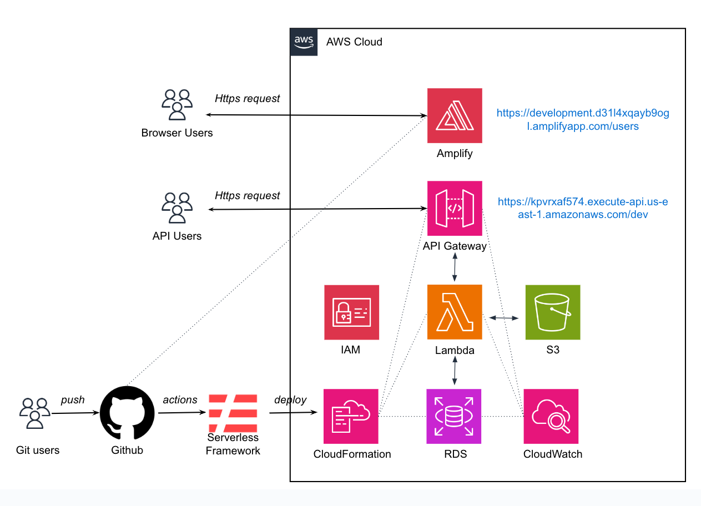
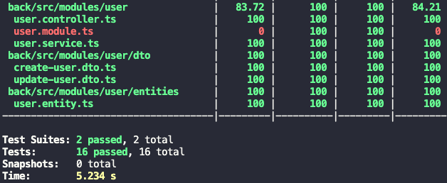

# Next.js & Nest.js Application

Aplicativo de Gerenciamento de Clientes

Link do app hospedado na AWS: [Frontend](https://development.d31l4xqayb9ogl.amplifyapp.com/users)

## Architecture



## Features

-   Language: [TypeScript](https://www.typescriptlang.org/)

## Frontend Features

-   Framework: [Next.js](https://nextjs.org/)
-   Styling: [SaSS](https://sass-lang.com/documentation/)
-   React Components: [MaterialUI](https://mui.com/)
-   HTTP client: [Axios](https://axios-http.com/ptbr/)
-   Validator: [React Hook Form](https://react-hook-form.com/) with [Yup](https://www.npmjs.com/package/yup)
-   State Manager: [Redux Toolkits](https://redux-toolkit.js.org/usage/usage-with-typescript)

## Backend Features

-   Framework: [Nest.js](https://nestjs.com/)
-   Database: [PostgreSQL](https://www.postgresql.org/)
-   Database Container: [Docker](https://docs.docker.com/compose/)
-   Database ORM, Migrations and Seeding: [TypeOrm](https://typeorm.io/)
-   Documentation: [Swagger](https://docs.nestjs.com/openapi/introduction)
-   Tests: [Jest](https://jestjs.io/pt-BR/)
-   100 % Coverage on Service and Controller
    

## AWS Cloud Features

-   Cloud Service: [Amazon Web Service](https://aws.amazon.com/pt/)

## CI/CD Features

-   IaC: [ServerlessFramework](https://www.serverless.com/framework/docs/getting-started)
-   CI/CD: [Github Actions](https://docs.github.com/pt/actions)

## How to run

### Frontend

```bash
$ cd frontend

# install dependencies
$ npm install

# run app
$ npm run dev
```

### Backend

```bash
$ cd backend

# install dependencies
$ npm install

# run app
$ npm run dev
```

### Docker

```bash
# run app
$ docker-compose up
```

### Seeding

```bash
$ npm run seed
```
