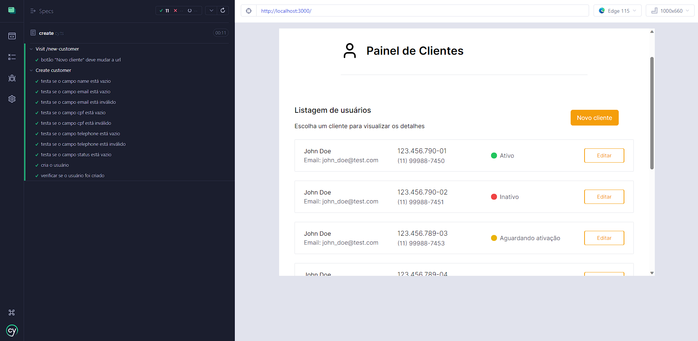
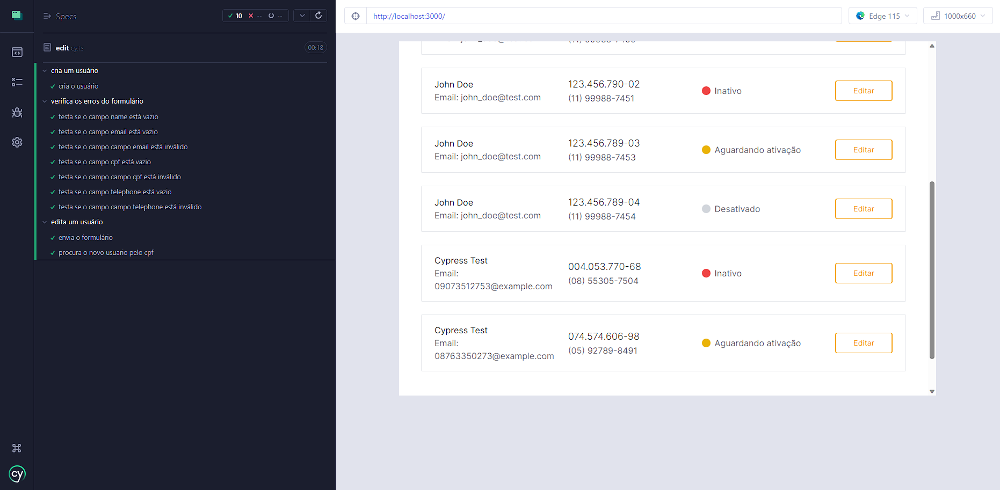
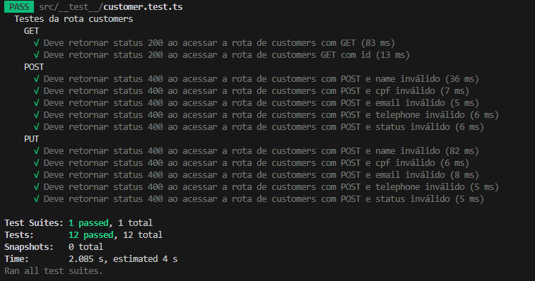
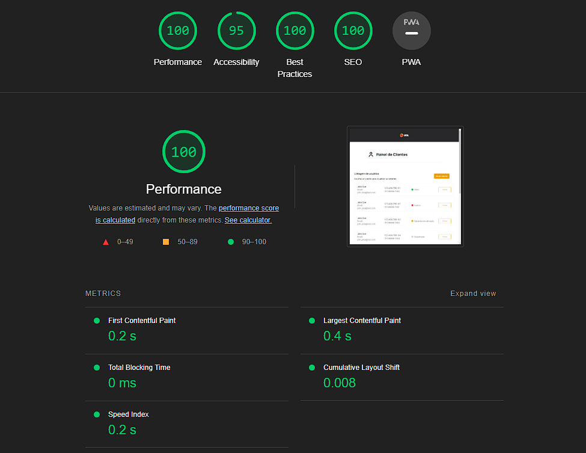

# Teste Fullstack: Aplicativo de Gerenciamento de Clientes

## Descrição

Este repositório contém o código de um aplicativo WEB de gerenciamento de clientes, desenvolvido como desafio técnico fullstack para a vaga de Pessoa Desenvolvedora na [UOL](https://www.linkedin.com/company/uol/). O aplicativo possui ênfase em responsividade e acessibilidade. É composto por um frontend e um backend, responsáveis, respectivamente, pela interface do usuário e pelo armazenamento de dados dos clientes.

## Funcionalidades

### Frontend

O frontend possui as seguintes funcionalidades:

- Exibição da listagem de clientes com informações de acordo com o layout fornecido.
- Criação de novos clientes através de um formulário.
- Alertas de validação ao editar dados inválidos.
- Validação de CPF e telefone durante a edição.
- Comunicação com a API para obtenção de dados dos clientes.

### Backend

O backend disponibiliza os seguintes endpoints para interação com os dados dos clientes:

- `GET /customer`: Obtém a lista de clientes cadastrados.
- `GET /customer/:id`: Obtém informações de um cliente específico.
- `POST /customer`: Cadastra um novo cliente com informações válidas.
- `PUT /customer/:id`: Atualiza informações de um cliente existente.

## Tecnologias Utilizadas

### Frontend

- Next.js
- Tailwind CSS
- Cypress (para testes automatizados e2e)
- Jest
- Axios

### Backend

- Fastify
- Sequelize (ORM)
- SQLite (banco de dados)
- Jest
- Axios

## Rodando o Projeto

### Com docker:

1. Abra um terminal na raiz do projeto.
2. Execute o comando `docker compose up -d`
3. Abra [http://localhost:3000](http://localhost:3000)

OBS: Eu testei o projeto apenas no Windows, mas de vez em quando me deparei com erros estranhos nos testes do frontend, parece que o servidor não compartilha os dados corretamente ou o cypress não funciona como deveria, mas usando no navegador tudo funciona normal. Revisei as configurações do Docker, criei volumes e revisei o cypress, mas não achei erro algum, quando rodo sem o docker tudo funciona corretamente. Acho que pode ter alguma coisa a ver com a rede do meu computador. De qualquer forma, caso queira testar o frontend, sugiro rodar o projeto sem usar o Docker.

### Sem docker:

1. Abra dois terminais, um para o frontend e outro para o backend.
2. No terminal do backend, navegue até a pasta e execute os comandos:
```bash
npm install
```
```bash
npm start
```
3. No terminal do frontend, navegue até a pasta e execute os comandos:
```bash
npm install
```
```bash
npm run build
```
```bash
npm start
```
4. Abra [http://localhost:3000](http://localhost:3000)

## Executando os Testes

### Frontend

1. Abra um novo terminal e navegue até a pasta do frontend.
2. Execute o comando `npm install`.
3. Execute o comando `npm test`.
4. Selecione a opção `e2e`.
5. Escolha um navegador.
6. Na aba `Specs`, selecione um dos testes disponíveis.

Observação: Certifique-se de que o projeto esteja rodando para que os testes funcionem corretamente.

### Backend

1. Abra um novo terminal e navegue até a pasta do backend.
2. Execute o comando `npm install`.
3. Execute o comando `npm test`.

Observação: Certifique-se de que o projeto esteja rodando para que os testes funcionem corretamente.

## Restaurando o BD

1. Abra um novo terminal e navegue até a pasta do backend.
2. Execute o comando `npm run restore`.

## Resultados dos testes







## Resultados do Lighthouse

No Lighthouse, o projeto apresentou métricas positivas, porém não atingiu 100 pontos em acessibilidade devido ao esquema de cores dos botões do layout.


