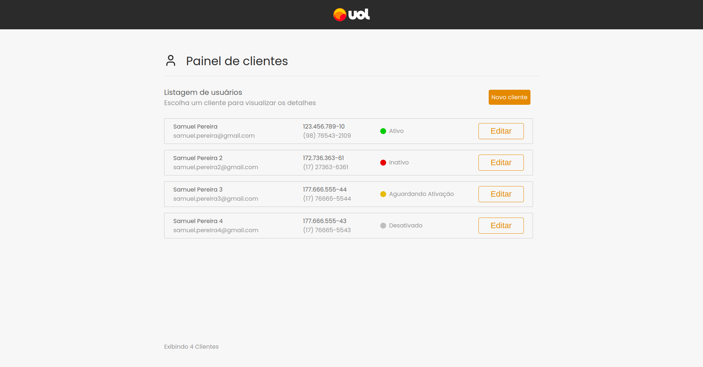
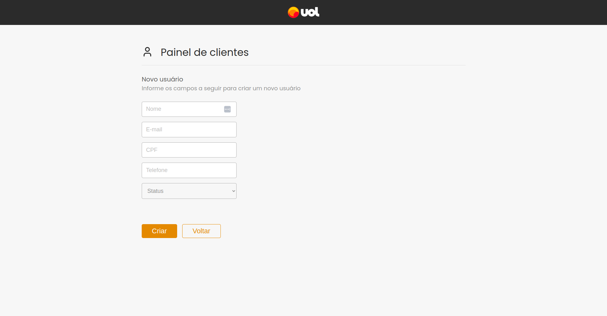
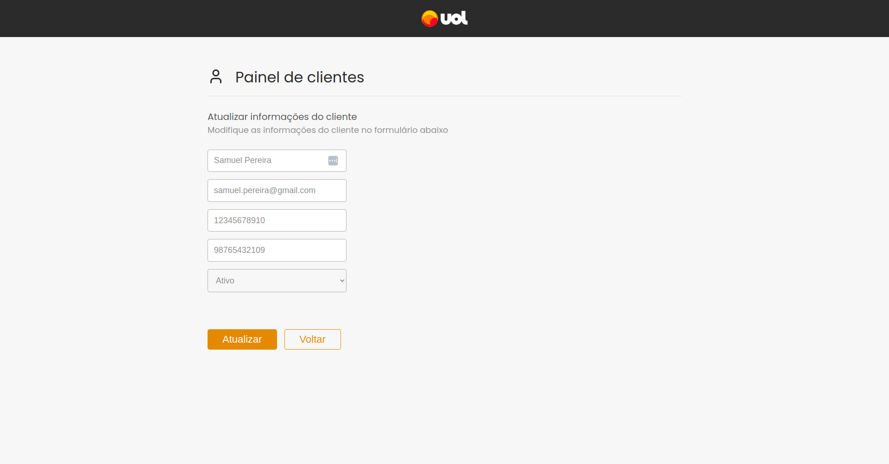
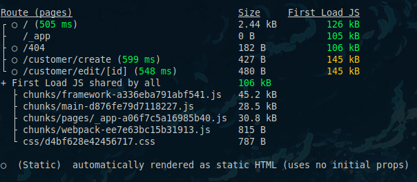
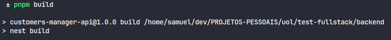
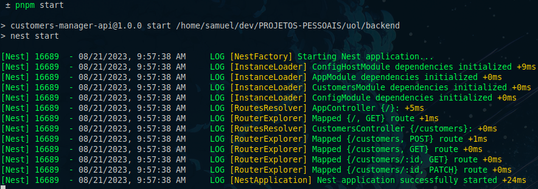
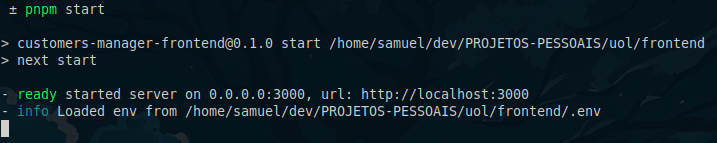
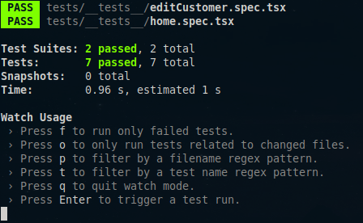
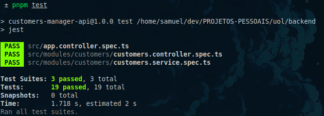

# Customers Manager

> O Customers Manager é uma aplicação web que te ajuda a gerenciar seus clientes cadastrados no sistema.

## ⚙️ Funcionalidades
* Listar todos os clientes
  
* Cadastrar um novo cliente
  
* Editar as informações de um cliente
  

## 🚀 Endpoints

#### `POST /customers` - Cadastrar um novo cliente

- Este endpoint espera o seguinte formato de body

  ```bash
  {
    "name": "Customer Name",
    "email": "customer.name@email.com",
    "taxId": "12345678901",
    "phone": "98765432101",
    "status": "Aguardando Ativação"
  }
  ```

#### `GET /customers` - Exibir listagem dos clientes

- O retorno esperado é uma listagem de todos os clientes cadastrados
  ```bash
  [
  	{
  		"id": 1,
  		"name": "Samuel da Silva Pereira",
  		"email": "samuel.pereira@gmail.com",
  		"taxId": "12345678901",
  		"phone": "12345678901",
  		"status": "Ativo"
  	},
  	{
  		"id": 2,
  		"name": "Samuel Pereira",
  		"email": "samuel.pereira2@gmail.com",
  		"taxId": "12345678902",
  		"phone": "12345678901",
  		"status": "Inativo"
  	},
  	{
  		"id": 3,
  		"name": "Walmir Junior",
  		"email": "walmir.santos0@gmail.com",
  		"taxId": "33333333490",
  		"phone": "33333333490",
  		"status": "Aguardando Ativação"
  	}
  ]
  ```

#### `GET /customers/:id` - Exibir informações de um cliente específico

- O retorno esperado é um objeto com as informações do cliente desejado
  ```bash
  {
  	"id": 1,
  	"name": "Samuel da Silva Pereira",
  	"email": "samuel.pereira@gmail.com",
  	"taxId": "12345678901",
  	"phone": "12345678901",
  	"status": "Ativo"
  }
  ```

#### `PATCH /customers/:id` - Atualizar informações de um cliente

- Este endpoint espera o seguinte formato de body
  ```bash
  {
  	"name": "Samuel da Silva atualizado",
  	"email": "samuel.pereira@gmail.com",
  	"taxId": "12345678901",
  	"phone": "12345678901",
  	"status": "Ativo"
  }

  # Todos os campos são opcionais então se você deseja alterar apenas o nome do cliente, por exemplo, basta enviar esta informação no body:

  {
    "name": "Samuel da Silva atualizado"
  }

  ```

## 🛠️ Tecnologias utilizadas
#### Front-end
* [TypeScript](https://www.typescriptlang.org/)
* [React](https://react.dev)
* [Next.js](https://nextjs.org/)
* [styled-components](https://styled-components.com/)
* [Axios](https://axios-http.com/ptbr/)
* [react-hook-form](https://react-hook-form.com/)
* [Lucide](https://lucide.dev/)

#### Back-end
* [TypeScript](https://www.typescriptlang.org/)
* [NestJS](https://nestjs.com/) (Framework de Node.js)
* [Prisma](https://www.prisma.io/) (ORM)
* [SQLite](https://www.sqlite.org/index.html) (Banco de dados)
## 🌱 Pré-requisitos
* Instale a última versão do [Node](https://nodejs.org/en/);
* O gerenciador de pacotes utilizado no projeto é o [pnpm](https://pnpm.io/pt/) mas fique a vontade para usar `npm` ou `yarn` se desejar;
* Para garantir o funcionamento de todas as funcionalidades da aplicação é recomendado o uso do [Google Chrome](https://www.google.com/intl/pt-BR/chrome/);
* Para clonar o repositório instale e configure o [git](https://git-scm.com/);
* Para testar os endpoints use uma ferramenta de requisições como [Postman](https://www.postman.com/) ou [Insomnia](https://insomnia.rest/)

## ▶️ Executando o projeto localmente
#### 1º Abra um terminal e faça o clone do projeto em sua máquina
```bash
git clone https://github.com/SP-Sam/test-fullstack.git

# Se você tem uma chave SSH configurada
git clone git@github.com:SP-Sam/test-fullstack.git
```
#### 2º Navegue até o diretório dos projetos e rode os comandos do passo 3 em diante em cada um deles
```bash
# Back-end
cd test-fullstack/backend

# Front-end
cd test-fullstack/frontend
```
#### 3º Instale as dependências do projeto
```bash
# pnpm
pnpm install

# npm
npm install

# yarn
yarn
```
#### 4º Inicie o processo de build do projeto e aguarde até estar finalizado
```bash
# No backend rode o seguinte comando antes do build
pnpm generate
# ou
npm run generate
# ou
yarn generate

# pnpm
pnpm build

# npm
npm run build

# yarn
yarn build
```
#### Você verá algo parecido com isso no terminal


> Front-end



> Back-end

#### 5º Inicie o projeto
```bash
# pnpm
pnpm start

# npm
npm start

# yarn
yarn start
```
#### Você verá algo parecido com isso no terminal


> Back-end



> Front-end

### É só dar um `Ctrl+Click` no link ou colar `http://localhost:3000` no seu navegador e começar a usar!

## 🧪 Executando os testes do projeto
O Customers Manager possui testes unitários. Para executa-los abra um terminal na raiz do projeto (backend ou frontend) e rode o seguinte comando:
```bash
# pnpm
pnpm test

# npm
npm test

# yarn
yarn test
```
#### Você verá algo parecido com isso no terminal


> Front-end



> Back-end

#### Os testes serão executados no `watch mode` do Jest. Para sair do `watch mode` basta apertar a tecla `q` ou `Ctrl+C`.

## 👨‍💻 Desenvolvedor
<a href="https://www.linkedin.com/in/spsam/">
  
  <br>
  <b>Samuel Pereira</b>
</a>

## 🖋️ Licença
Este projeto é um desafio técnico para um processo seletivo da empresa [UOL](https://www.uol.com.br/), não possui fins lucrativos e não está licenciado.

[⬆️ Voltar ao topo](#customers-manager)
<br>
