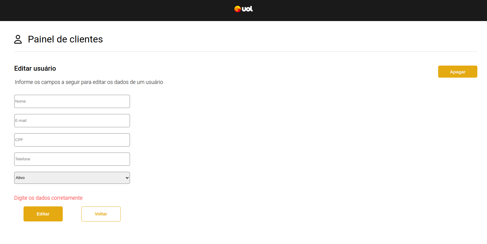

# Teste Fullstack: Aplicativo de Gerenciamento de Clientes

Um aplicativo de gerenciamento de clientes, que permite ao usuário criar, editar e listar os clientes salvos em um banco de dados.

## Executando a Aplicação

1. Entre na pasta raiz do projeto

```bash
  cd test-fullstack
```

2. Instale as dependências da Aplicação

```bash
  npm install
```

3. Inicie a aplicação

```bash
  npm start
```

## Stack utilizada

**Front-end:** React, React Router Dom

**Back-end:** Node, Express, Sqlite, Mocha, Chai, Sinon

## FrontEnd

O FrontEnd é executado em http://localhost:3000

- Página onde ocorre a listagem dos clientes
  

- Tela onde são criados novos clientes
  

- Tela de edição dos clientes
  

## Documentação da API (BackEnd)

A API é executada em http://localhost:3001

### Tabela do Banco de Dados (Sqlite)

| Parâmetro  | Tipo     | Descrição                                                |
| :--------- | :------- | :------------------------------------------------------- |
| `id`       | `string` | **Primary Key**.                                         |
| `nome`     | `text`   | **Obrigatório**. Nome do cliente                         |
| `email`    | `string` | **Obrigatório**. Email do cliente                        |
| `cpf`      | `string` | **Obrigatório**. cpf do cliente                          |
| `telefone` | `string` | **Obrigatório**. Telefone do cliente                     |
| `status`   | `string` | **Obrigatório**. Ativo, inativo, aguardando e desativado |

#### Retorna todos os clientes

```http
  GET /
```

#### Retorna um cliente com base em seu :id

```http
  GET /${id}
```

#### Cria um novo cliente

```http
  POST /
```

#### Atualiza os dados de um cliente existente

```http
  PUT /${id}
```

#### Deleta um cliente

```http
  DELETE /${id}
```

### Rodando os Testes do BackEnd

1. Entre no diretório backend

```bash
  cd backend
```

2. Execute o comando

```bash
  npm test
```
