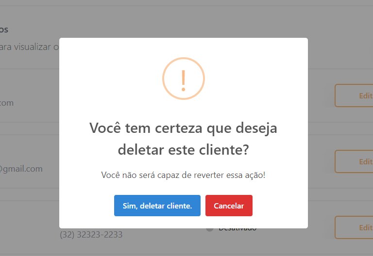

# :computer: Uol - Gerenciamento de Clientes :computer:


## :page_with_curl: Sobre

Esse projeto tem como objetivo construir uma aplicação CRUD Fullstack para cadastro de clientes.

<br />

Além de poder instalar e rodar o projeto localmente, você pode também interagir com essa
[<strong>versão online em um deploy realizado no Vercel</strong>](https://uolfront.vercel.app/).

> 	:bangbang: Como o deploy é feito um em plano gratuito, a primeira requisição pode demorar um pouco para carregar. :bangbang:


<br />

E também é possível verificar a API neste [<strong>deploy realizado no Render</strong>](https://uol-api.onrender.com/).


<br />
<br />


## :wrench: Ferramentas utilizadas

<strong>Frontend<strong/>
* JavaScript
* React.js
* Tailwind.css
* Vite
* Sweet Alert
* React Router
* React Toastify
* Lucide icons
* React Loading Components


<strong>Backend<strong/>
* Node.js
* Express.js
* Cors
* Zod
* TypeORM
* PostgreSQL
  

## :hammer_and_wrench: Instalação e execução


<details>
  <summary markdown="span"><strong>Rodando a aplicação localmente</strong></summary><br />

Para rodar está aplicação localmente é necessário ter **Git**, **Node** e o **PostgreSQL** instalados e atualizados em seu computador.

Também é necessário que o seu sistema operacional tenha um **terminal Bash** instalado. Caso você esteja utilizando **Linux** ou **macOS**, o Bash já vem instalado por padrão. Porém, se o seu sistema for **Windows**, talvez você precise fazer [a instalação a parte](https://www.lifewire.com/install-bash-on-windows-10-4101773).

<details>
  <summary markdown="span"><strong> :hammer: Configurando o Back-end</strong></summary><br />
  
    
    1. Clone o repositório

  - Use o comando: `git clone git@github.com:edson-mac/test-fullstack.git`.
  - Entre na pasta do repositório que você acabou de clonar:
    - `cd test-fullstack`
    
  2. Entre na pasta do Backend

  - `cd uol-backend`

  3. Instale as dependências

  - `npm install`
    
  <summary markdown="span"><strong>Configurando o banco de dados e .env</strong></summary><br />
  
  O projeto vem configurado para rodar em um banco de dados PostgreSQL, então é nessário instalar 
  PostgreSQL em seu computador ou utilizar um servidor na nuvem. Após ter configurado seu banco, é necessário configurar
    as variáveis de ambiente:

### 1. Em um arquivo .env na raíz do repositório, adicione as configurações de seu banco MySQL:

```sh
DB_HOST=
DB_NAME=
DB_USER=
DB_PASSWORD=
DB_PORT=
```

### 2. Nesse mesmo arquivo .env, a porta do Express desejada para rodar o servidor

```sh
PORT=
```
### 3. Depois de preencher os dados no env pra se conectar ao banco só utilizar em sequência, para gerar e rodar as migrations que populam o banco:
  
  - `npm run migration:generate`
  - `npm run migration:run`

### 4. Por fim, após ter efetuado todas as configurações, rode o servidor utilizando este comando no diretório uol-backend:
  
  - `npm run dev`

  
  </details>
  
   <details>
  <summary markdown="span"><strong> :sunrise: Configurando o Front-end</strong></summary><br />
  
    
    1. Acesse o repositório
  
  - Entre na pasta do repositório:
    - `cd test-fullstack`
    
  2. Entre na pasta do Frontend

  - `cd uol-frontend`

  3. Instale as dependências

  - `npm install`
    
  <summary markdown="span"><strong>Configurando variáveis de ambiente</strong></summary><br />
  
  O projeto Frontend vem configurado para fazer diversas requisições para uma API, o endereço vai mudar dependendo de como você rodar o projeto, por isso é necessário configurar
    as variáveis de ambiente:

### 1. Em um arquivo .env na raíz do repositório, adicione as configurações de seu endereço no API como no exemplo abaixo:

```sh
VITE_API_URL="https://uol-api.onrender.com/"
```

### 3. Por fim, após ter efetuado todas as configurações, rode o servidor utilizando este comando no diretório ostenfrontend:
  
  - `npm start`

  
  </details>
  
 </details>
 
 ## :computer: Documentação e rotas da API:

 <summary markdown="span"><strong>Obtendo lista de todos os clientes - GET /</strong></summary><br />
 <summary markdown="span"><strong>Excluindo uma empresa - DELETE /ID</strong></summary><br />
 <summary markdown="span"><strong>Obtendo cliente por ID - GET /ID</strong></summary><br />
 
<details>
  <summary markdown="span"><strong>Cadastrando um cliente - POST / </strong></summary><br />
  
```sh
body = {
          "name": "Edson Caparroz",
          "email": "edson-mac@hotmail.com",
          "cpf": "22222222222",
          "phone": "11982344005",
           "status": "Ativo",
        }
```
</details>

<details>
  <summary markdown="span"><strong>Editando um cliente por ID - PUT /ID </strong></summary><br />
  
```sh
body = {
          "id": 53,
          "name": "Edson Caparroz",
          "email": "edson-mac@hotmail.com",
          "cpf": "22222222222",
          "phone": "11982344005",
           "status": "Ativo",
        }
```
</details>

 ## :sunrise: Interações com Frontend :sunrise:
<details>
  <summary markdown="span"><strong>Ícone de alerta com Modal para alerta de input</strong></summary><br />
  
</details>
<details>
  <summary markdown="span"><strong>Componente de Loading para aguardar requisições na API</strong></summary><br />
  
</details>
<details>
  <summary markdown="span"><strong>Alertas de sucesso ou falha para requisições na API</strong></summary><br />
  
  
</details>
<details>
  <summary markdown="span"><strong>Opção de DELETE com ícone de Lixeira + Confirmação de ação</strong></summary><br />
  
  
</details>


 
 

