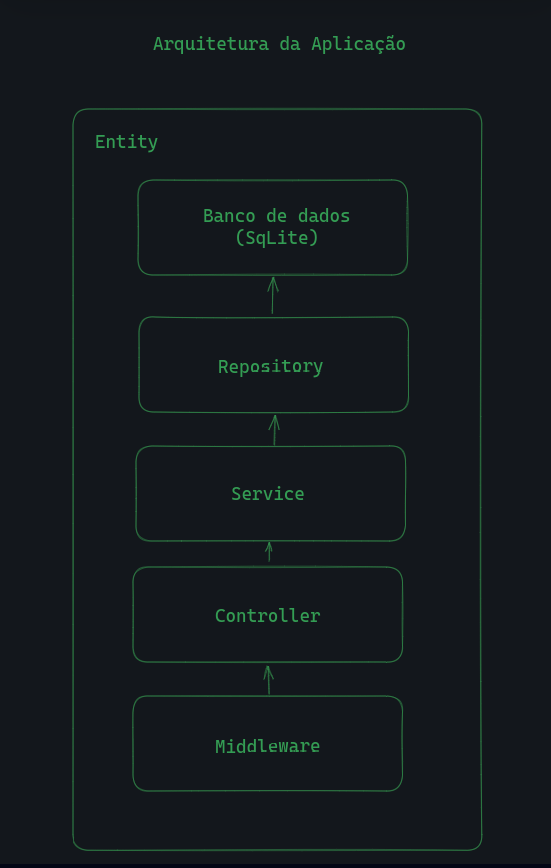

# Aplicativo de Gerenciamento de Clientes Backend



## Executando a Aplicação

A execução local pode ser dada das seguintes formas: Docker ou Node

<details>
  <summary><b>Iniciando o projeto com docker 🐳</b></summary>

  ***⚠️ Para garantir um bom funcionamento é necessário que tenha instalado o docker na versão 24.0.5 e 1.29 ou superior ⚠️***

  1. Clone o projeto

  2. Entre no diretório do projeto

  3. No diretório raiz do backend suba criei a imagem

  ```bash
$ docker build . -t client-management-api -f Dockerfile.dev
  ```

  4. Ainda diretório raiz do backend suba suba o container

  ```bash
$ docker run --name client-management-api -p 3001:3001 client-management-api
  ```

  5. Quando o processo do container estiver acabado acesse a aplicação usando o seguinte endereço

  ```bash
http://localhost:3001
  ```

</details>

<br />

<details>
  <summary><b>Iniciando o projeto com Node</b></summary>

  ***⚠️ Para garantir um bom funcionamento é necessário que tenha instalado o node na versão 16 ⚠️***

  1. Clone o projeto

  2. Entre no diretório do projeto

  3. No diretório raiz do backend instale as dependências

  ```bash
$ npm install
  ```

  4. Para configurar o projeto rode os seguintes comandos

  ```bash
$ npx prisma generate && echo "DATABASE_URL=file:./dev.db" > .env && npx prisma migrate dev
  ```

  5. Para iniciar o projeto rode

  ```bash
$ npm run start
  ```

  6. Quando o processo do container estiver acabado acesse a aplicação usando o seguinte endereço

  ```bash
http://localhost:3001
  ```

</details>

<br />

## Testes

Para a criação dos testes foi usando as seguintes bibliotecas

- Jest
- @nestjs/testing
- supertest

### Executando os testes 🧪

<details>
  <summary><b>Rodando testes com docker</b></summary>

  1. Garanta que o container já esteja ativo 

  2. Para rodar os testes unitários

  ```bash
$ docker exec -t <nome-do-container> npm run test
  ```

  3. Para rodar os testes e2e

  ```bash
$ docker exec -t <nome-do-container> npm run test:e2e
  ```

</details>

<br />

<details>
  <summary><b>Rodando testes localmente</b></summary>

  1. Garanta que as dependêcias já estejam instaladas e funionando 

  2. Para rodar os testes unitários

  ```bash
$ npm run test
  ```

  3. Para rodar os testes e2e

  ```bash
$ npm run test:e2e
  ```

</details>
