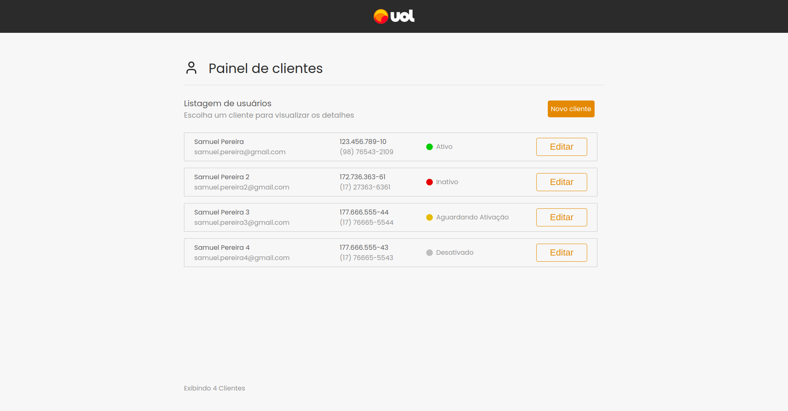
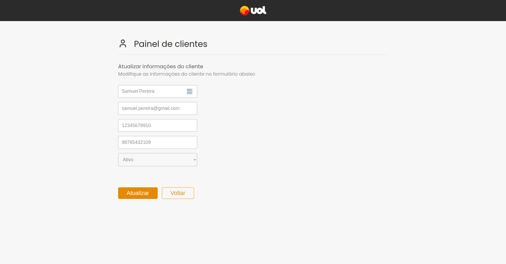
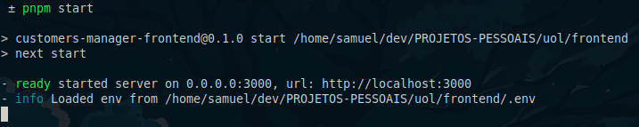

# Customers Manager

> O Customers Manager é uma aplicação web que te ajuda a gerenciar seus clientes cadastrados no sistema.

## ⚙️ Funcionalidades
* Listar todos os clientes
  
* Cadastrar um novo cliente
  
* Editar as informações de um cliente
  

## 🛠️ Tecnologias utilizadas
* [TypeScript](https://www.typescriptlang.org/) (Superset de JavaScript)
* [React](https://react.dev) (Framework de JavaScript)
* [Next.js](https://nextjs.org/) (Framework SSR para React)
* [styled-components](https://styled-components.com/) (CSS-in-JS)
* [Axios](https://axios-http.com/ptbr/) (Requisições à API)
* [react-hook-form](https://react-hook-form.com/) (Manipulação de formulários)
* [Lucide](https://lucide.dev/) (Ícones)

## 🌱 Pré-requisitos
* Instale a última versão do [Node](https://nodejs.org/en/);
* O gerenciador de pacotes utilizado no projeto é o [pnpm](https://pnpm.io/pt/) mas fique a vontade para usar o npm se desejar;
* Para garantir o funcionamento de todas as funcionalidades da aplicação é recomendado o uso do [Google Chrome](https://www.google.com/intl/pt-BR/chrome/);
* Para clonar o repositório instale e configure o [git](https://git-scm.com/).

## ▶️ Executando o projeto localmente
#### 1º Abra um terminal e faça o clone do projeto em sua máquina
```bash
git clone https://github.com/uoldevs/test-fullstack.git

# Se você tem uma chave SSH configurada
git clone git@github.com:uoldevs/test-fullstack.git
```
#### 2º Navegue até o diretório do projeto clonado
```bash
cd test-fullstack/frontend
```
#### 3º Instale as dependências do projeto
```bash
# pnpm
pnpm install

# npm
npm install
```
#### 4º Inicie o processo de build do projeto e aguarde até estar finalizado
```bash
# pnpm
pnpm build

# npm
npm run build
```
#### Você verá algo parecido com isso no terminal


#### 5º Inicie o projeto
```bash
# pnpm
pnpm start

# npm
npm start
```
#### Você verá algo parecido com isso no terminal


### É só dar um `Ctrl+Click` no link ou colar `http://localhost:3000` no seu navegador e começar a usar!

## 🧪 Executando os testes do projeto
O Customers Manager possui testes unitários. Para executa-los abra um terminal na raiz do projeto e rode o seguinte comando:
```bash
# pnpm
pnpm test

# npm
npm test

```
#### Você verá algo parecido com isso no terminal


#### Os testes serão executados no `watch mode` do Jest. Para sair do `watch mode` basta apertar a tecla `q` ou `Ctrl+C`.

## 👨‍💻 Desenvolvedor
<a href="https://www.linkedin.com/in/spsam/">
  
  <br>
  <b>Samuel Pereira</b>
</a>

## 🖋️ Licença
Este projeto é um desafio técnico para um processo seletivo da empresa [UOL](https://www.uol.com.br/), não possui fins lucrativos e não está licenciado.

[⬆️ Voltar ao topo](#customers-manager)
<br>
