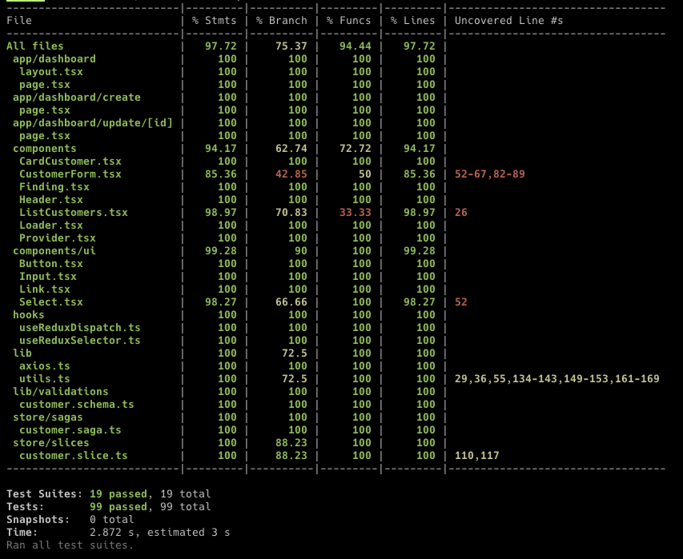

# Frontend

## Bibliotecas

- [NextJS](https://nextjs.org/)
- [Tailwind](https://tailwindcss.com/)
- [Formik](https://formik.org/)
- [Zod](https://zod.dev/)
- [Redux](https://redux.js.org/)
- [ReduxSaga](https://redux-saga.js.org/)
- [Cypress](https://www.cypress.io/)

## Como executar

```terminal
Instale todas as dependências:
$ cd web && npm install && cd ..

inicie o projeto web:
$ npm run dev
```

## Resultado dos testes de cobertura



## Layout


